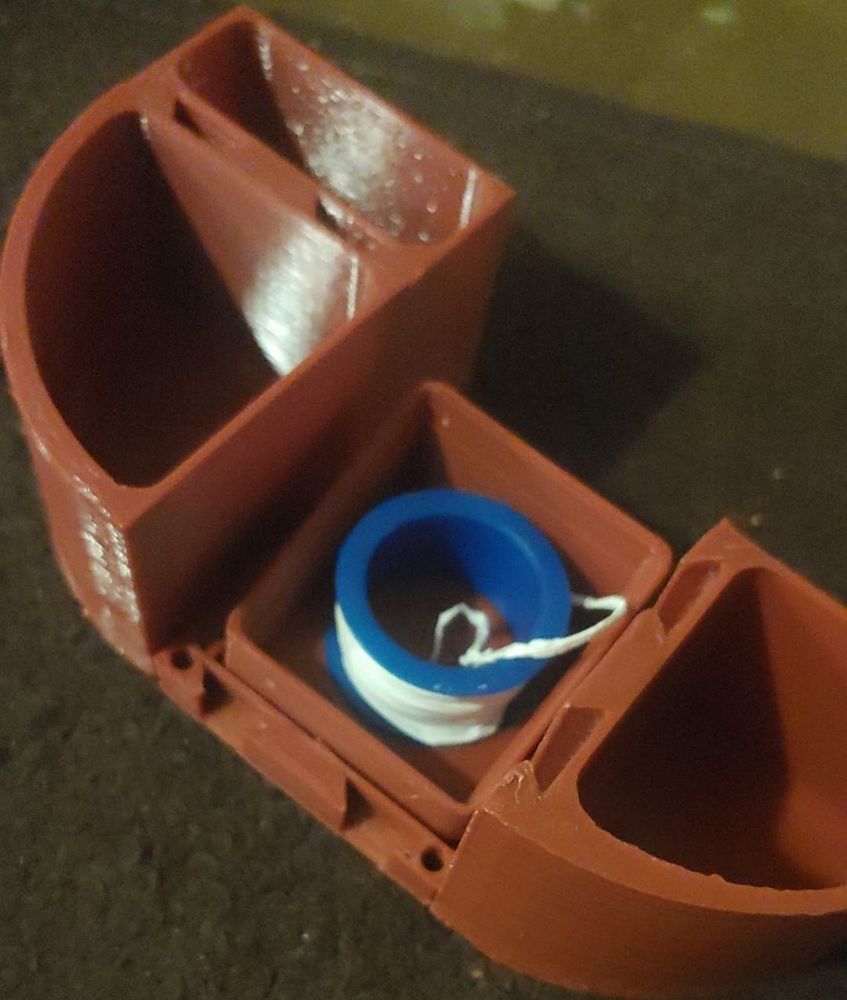

# PuzzleBlocs
3D Printable 25mm blocks for real life Minetest/Minecraft.  WIP

## Printing

The whole base set should print without any support.

## Textures

We do not have many decorative blocks, instead we have plate covers that slide onto blocks, with a fla surface for stickers.
so you can easily chane the look.

The "Official" texture pack for printable blocks is Drummyfish's hand painted one:
https://content.minetest.net/packages/drummyfish/drummyfish/

There's a printable "Variety Pack" file in the release.  To make your own, you can use the Tiled
editor to make a 7x10 tile map, import into libreoffice, resize to 6.89 by 9.84 to make each tile 24mm with a little bleed margin,
and export as PDF

## Common/Recommended Block Size code example

### 113M

25x25*25 WxDxH nominal in mm, actually smaller for clearance.  This is a basic cube.

### 115M

25x25*41.6 nominal.  Mostly used to fill a space, but a 115MBin can hold a pen.

### 221M
Used in the 221MGridfinityHolder. 50mm on a side and 8.33mm tall, it holds a 1x1 gridfinity tile, but does not support magnets.

### 223M

Used in the 223MArchedPlatform.  This is a flat table-like platform with kinda-decorative arches that can be used to run cables through.

### 126M

This is 25mm wide by 50mm long and  49mm tall.  Not that useful for storage aside from very small things!

### 126IR

The IR is for inverted right.  The right side, which would normally have male dovetails, instead has females,
meaning the only male is on one of the long ends.

You might want to use inverted blocks on the back and the right of your design.  That way, all exposed sides are female, and you can
cover them with plates to apply a label.

They can be thought of as adapters.  They are also very flexible and you can build a whole layout with them if you don't need it to be very secure.

### 216M

50mm across, 25 deep, and 49 tall, with connectors on all sides

### 206 Plates

This is a flat plate used to cover the female side of a block for decorative or labeling purposes.

The system is designed to keep the decorative elements separate on the plates, so you can easily change the look without new blocks.

### 003 Link Stick

This lets you attach 2 female sides together.  They wont pull apart but either side can lift up, it is not as secure.

They are 24mm long, three units.  As longer ones are not really needed and shorter ones would be an annoying small part, 
other link sticks do not exist.

## Naming Convention

Blocks are named starting with the width, depth, and height in 25mm, 25mm, and 8.33mm units respectively, followed by one letter for every
side missing it's connector.  

A 225FLRoundBin is inteded to go on the front letf corner of a layout, and so has no connectors on the front or left.

If there is no missing connectors, use M for Middle.   This way every block name identifies where it can go.

A block that has one side inverted, a male where a female would normally be or vice versa, should be marked with the letter I for the inverted side.

An IR block would have the connector on it's right inverted, giving only one male at the back.  These are useful because you can make an entire border
perimiter out of them.

## Assembly

The male connector holds down the female end, so you typically assemble starting from the rear right, slotting the male end into the female rail.

Layers have no vertical stacking features.  They are joined purely by using tall blocks that span multiple layers.

A 113 block is a perfect 24mm cube,  but heights vary by 8.33mm units, so unlike real Minecraft style blocks you don't use evenly sized layers.

Two males can't face each other, but two females can, and you can use a LinkStick to give the layout a bit more strength.

For extra security, blu-tak will hold things together very strongly, since there is mechanical pressure on it, while still allowing easy removal.

Hot glue should also work well for permanent use.

## Gridfinity

There is a gridfinity holder block you can use, it is a 221M size.  However, gridfinity tiles are 42mm and we are 50mm for a 221, so there is wasted space on all sides for the connector, and it does not sit perfectly centered.

Right now only 1x1 gridfinity blocks can be used. Larger adapters, or even a tilable adapter system TBD.

This does not aim to replace Gridfinity, it just aims to cover more 3D layered and nonrectangular uses, while keeping compatibility.

## Spec

(WIP!  See FreeCAD files!! They are made using Assembly3)

25 mm X and Y units, 8.33mm vertical.  Subtract 1mm from the real dimension for clearance, so a 2 unit wide block is really 49mm.

Centered on the back and right side is a male dovetail.  It is 5mm wide at the base and extends 4mm.  It's angle is 50 degrees per side, or 130 the other way.

The female dovetail is 4.5 deep, and 6.4mm at the base for clearence, and goes on the left and front.

Inversions, a bin where that has the gender of one side swapped, and bins with missing connections, are allowed.]

Should a block be multiple units, you must have a dovetail every 25mm, starting 25mm from the imaginary edge of the block, excluding the clearance gap
between blocks

The male dovetail only extends 8.333mm high starting from the base of the model.

### Wedge Stopper

To stop the male piece from sliding out the bottom of the dovetail, the bottoms of the female dovetails are closed.

At the bottom of the male, the first 0.5mm is missing, then there is a 45 degree cutout, because we have to print as an overhang.

At the bottom of the female, we have a 45 degree wedge stopper extending from the back to the front, going downwards as you go away from the center of a block.

### The lock slot(TBD)

Starting 8.5mm from the base of the part on all female sides where practical, there should be a cutout 4.5mm in from the female edge.

This cutout does not have exact specifications, to ease manufacturing restrictions.  It is intended to be sized such that one could stuff
a piece of 4mm OD tubing or rolled up paper into it to use as a roll pin, holding the male end down, or to run some paracord through for a similiar purpose.

It should not be circular, there should be a small amount of compression when the tube is in, and there should be room to grip ot with pliers or tweezers
for removal.

Note that it may not be possible to remove the tube without needle nose pliers or tweezers, this is a semipermanent method.